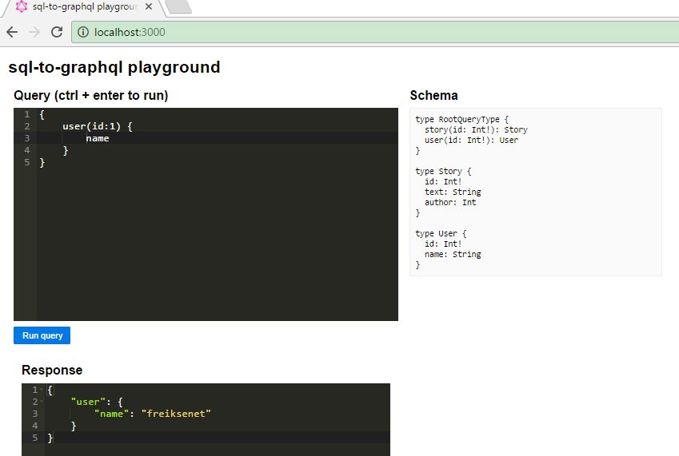
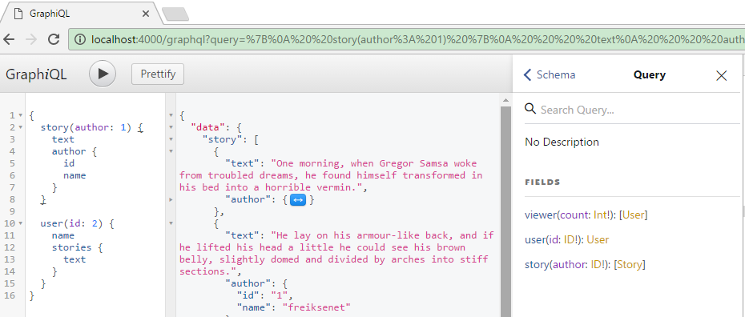

# Quick start
* `npm install babel-cli -g` to install babel.
* `npm install` to install dependencies.
* `babel-node index.js` to run script.

# Demos

## hello world
* `cd src`
* `babel-node hello-world.js`
* query:
```
{ hello }
```
* output:
```json
{
  "data": {
    "hello": "world"
  }
}
```

## blog
* This demo is based on [kadirahq/graphql-blog-schema](https://github.com/kadirahq/graphql-blog-schema).
* `cd src/blog`
* `babel-node index.js`
* query
```graphql
{
  recentPosts(count: 2) {
    _id
  }
}
```
* outout
```json
{
  "data": {
    "recentPosts": [
      {
        "_id": "03390abb5570ce03ae524397d215713b"
      },
      {
        "_id": "2f6b59fd0b182dc6e2f0051696c70d70"
      }
    ]
  }
}
```

## mysql
* This demo is based on [graphql-nodejs-newsfeed](https://github.com/reindexio/graphql-nodejs-newsfeed)
* **Attention**! You should run the `src/mysql/createdb.sql` first to create your database.
<!-- * `npm install node-pre-gyp -g` for sqlite3 -->
* `cd src/mysql`
* `babel-node index.js`
* query
```graphql
{
  user(id:2) {
    name,
    stories {
      text
    }
  }
}
```
* output
```json
{
  "data": {
    "user": {
      "name": "fson",
      "stories": [
        {
          "text": "A collection of textile samples lay spread out on the table - Samsa was a travelling salesman - and above it there hung a picture that he had recently cut out of an illustrated magazine and housed in a nice, gilded frame."
        },
        {
          "text": "Gregor then turned to look out the window at the dull weather. Drops of rain could be heard hitting the pane, which made him feel quite sad."
        }
      ]
    }
  }
}
```

## mysql/sql-to-graphql
* `npm install sql-to-graphql -g` to install `sql2graphql`
* `sql2graphql --database yourdatabase --host localhost --user root --password yourpassword --output-dir ./yourproject`
* `cd yourproject`
* `npm install`
* `npm start`
* 

## koa-graphql
* `cd src/koa-graphql`
* `babel-node hello-world.js` OR `babel-node blog.js` OR `babel-node mysql.js`
* Open Chrome & visit `http://localhost:4000/graphql?query={hello}`
* If you disable `graphiql`, you can get data directly through the URL
* 
